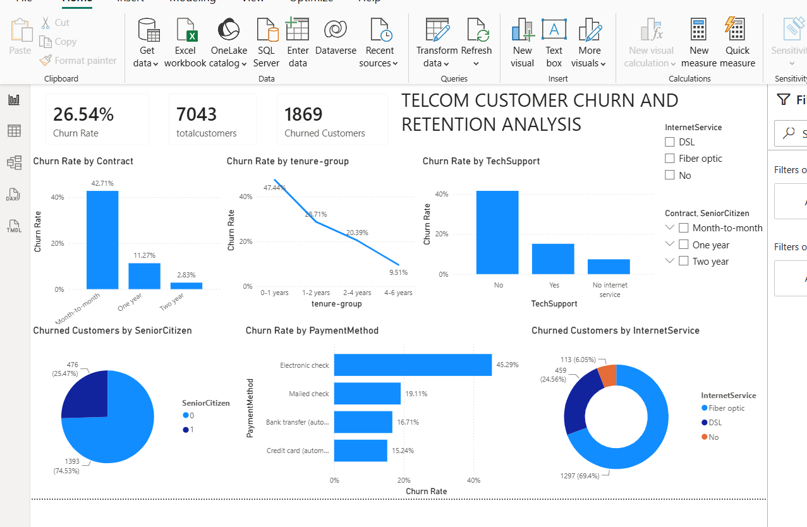

# Telco Customer Churn Analysis

## Project Overview

This project analyzes customer churn patterns using the IBM Telco Customer Churn dataset. 
The analysis was performed using Excel and Power BI to identify customer segments associated with different churn rates.

## Objective

To analyze customer churn patterns based on customer tenure, contract type, internet service, payment method, technical support, and senior citizen status.

## Tools Used

- Microsoft Excel
- Power Query
- Power BI
- DAX

## Dashboard

## Key Insights

- Overall churn rate was 26.54%.
- Customers with 0–1 year of tenure had the highest observed churn rate.
- Month-to-month customers showed substantially higher churn than customers with longer contracts.
- Electronic-check users showed a higher observed churn rate than other payment methods.
- Fiber-optic customers showed higher observed churn than DSL customers.
- Customers without technical support showed higher observed churn.

## Business Recommendations

- Investigate onboarding and early-stage customer retention.
- Examine the reasons for higher churn among month-to-month customers.
- Investigate payment-related customer experience.
- Examine service-related issues among fiber-optic customers.
- Evaluate the relationship between technical support availability and customer retention.

## Project Files

- `Excel/` – Excel analysis and EDA
- `PowerBI/` – Power BI dashboard
- `Documentation/` – Project documentation
- `images/` – Dashboard screenshots
